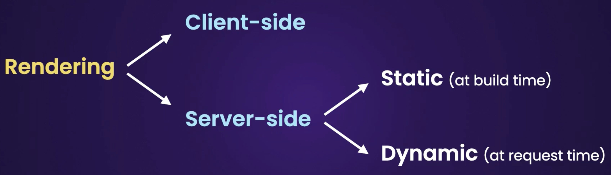

This is a [Next.js](https://nextjs.org/) project bootstrapped with [`create-next-app`](https://github.com/vercel/next.js/tree/canary/packages/create-next-app).

## Getting Started

First, run the development server:

```bash
npm run dev
# or
yarn dev
# or
pnpm dev
```

Open [http://localhost:3000](http://localhost:3000) with your browser to see the result.

## Learn More

To learn more about Next.js, take a look at the following resources:

- [Next.js Documentation](https://nextjs.org/docs) - learn about Next.js features and API.
- [Learn Next.js](https://nextjs.org/learn) - an interactive Next.js tutorial.

You can check out [the Next.js GitHub repository](https://github.com/vercel/next.js/) - your feedback and contributions are welcome!

## Deploy on Vercel

The easiest way to deploy your Next.js app is to use the [Vercel Platform](https://vercel.com/new?utm_medium=default-template&filter=next.js&utm_source=create-next-app&utm_campaign=create-next-app-readme) from the creators of Next.js.

Check out our [Next.js deployment documentation](https://nextjs.org/docs/deployment) for more details.

# About Development

#### VSCode libraries

- ES7
- Typescript
- Tailwind

#### jsonplaceholder

- Fake backend to get json objects [link](https://jsonplaceholder.typicode.com/)

#### Data Cache in NextJS, fetch from server components

- By default you get cache in server side components using the built in fetch library.
- data can be get from memory (data structures), file system (cache) or network (live). fetch uses file system built in.
- you add a second param to the fetch call, usually its enabled, you can disable it using { cache: 'no-store' }, for data that changes frequently.
- you can also set a deterministic time, like {nex: {revalidate: 10}} --> being 10 seconds
- other libraries like axios do not bring this cache functionality out of the box and need more custom configuration

## Rendering with nextjS



#### Static Rendering

- rendering pages and data from the cache file system.
- the data is placed in the cache during the build
- we can see this distinction when compiling the build bundle, during dev mode you don't see the effect. (npm run build, npm start)

#### Dynamic Rendering

- this happens at request time
- ƒ (Dynamic) server-rendered on demand
- this happen when we add { cache: 'no-store' } to a ssr component which is fetching data.

#### Styling, global, css modules and Tailwind

- css module is a css file scoped to a component or page.
  - it solves the problem that overrides styles with the same name when imported (the order for importing them matters because of its precedence)
  - Because this are imported as properties in JSX, they are declared in camelCase
- Tailwing - callenges in separation of concerns, but thinking in modular styling, the component can
  have the styles and do not care about the implementation details
- Tailwing is good when refactoring, if we remove the styles from one file, this css styles wont be imported in the production bundle, so its better to clean up code. the oppositve with modular css, we need to remember to clear the declaration isnstances.

#### DaysiUI

- This needs Node and Tailwind to be installed.
- npm i -D daisyui@latest
- follow installation instructions `https://daisyui.com/docs/install/`

## Routing NextJS

#### Dynamic Routing

- built-in routing mapping to folder name, you use [id] , [slug], etc
- this is available only on Page.tsx as built int props params: {id}, other component in the folder level wont have access to the dynamic param
- nested ID need the structure slug1/[id]/slug2/[other_id].
- id identificators should not repeat, slugs can repeat.

#### Catch-all segments Routing

- if we need a very dynamic url with many slugs (referring to categories for example), you can use the catch-all segment feature. [...slug], the base route will require to have a slug after.
- this ...slug will be captured as an array of slug items.
- if we want the slug to be optional, for instance, users/ (all of them) and users/students/active/curreny_year (to make a inline filter), we use double square brakets: [[...slug]]

#### Link elements

- it only downloads the content target, being a src (server render component) or client component but not other data.
- it pre-fecthes the links that are in the viewport.
  - this can be seen in prod, build the app. for instance, links to query params will be pre-fetched to improve performance (link page to href="/users?sortOrder=name" or href="/users?sortOrder=email")
- chaches pages on the client, to improve performance, it doesn't call the server again.

#### Page cache

- it is cleared every full page reload.

#### useRouter()

- use for programmatic navigation
- make sure to import from 'router/navigation'.
  - note that next/router is discontinued

#### Suspense

- a special wrapper component to show something while data is being loaded.
- syntax: `<Suspense fallback={<p>Loading ... </p>}>`
- SEO impact, you will see the 1st html loaded, shows the loading states for suspense = true.
  however this doesnt impact the SEO, because the connection pool is not closed and the data is retrieved.
  SEO knows it and reads the data when it loads.
  - This is called streamming (the same way as videos, nextjs streams html content)
- What if we want to wrap a whole page instead of sections of the page?
  - you can use the layout component to place the suspense element

#### Loading page

- another approach to display the user with a loading state is using hte laoding.tsx file.
- works similar to layout, page, not-found pages.

#### Not-found page

- These pages can live at the page level to give a customized message.
- The precedence: first use the page level file, then the root level file, if not, the default nextjs
- To call it from a validation statement: notFound() `import { notFound } from "next/navigation"`
- important to show when page url is valid but query does not have valid data, eg. user id > 100
